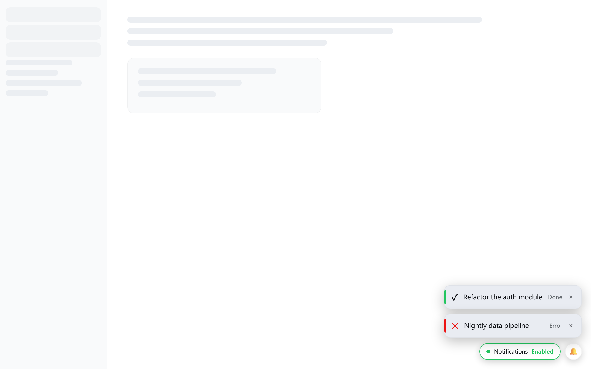

# dsh-live-notify

> [中文版](./README.zh.md)

A [DeepSeek Harness](https://github.com/deepseek-ai/deepseek-harness) dynamic Cordis plugin that shows a toast in the bottom-right corner when a session turn completes or errors, and fires a browser **system notification** when you are away from the page (another tab, minimized window, or lost focus).

The UI language follows the harness language setting (English / 中文) and all colors use the harness theme tokens, adapting to light and dark themes.

## Features

- **In-page**: turns completed or errored in *other* sessions pop a themed toast (Done 8 s / Error 15 s); click to jump to the session, hover to pause, × to dismiss, max 3 stacked
- **Away from page**: any session (including the current one) completing fires a system notification; clicking it focuses the window and opens the session
- **Back on page**: events from while you were away replay as toasts; with no notification permission, the tab title flashes "●" instead
- **Controls**: a status pill (green = on / red = off / amber = tap to allow / red dot = blocked) plus a mute bell
- **i18n**: all plugin text follows the harness locale (`zh` / `en`) and updates live on `locale/change`

## Repository layout

| File | Content |
|---|---|
| `src/host.js` | Host half (`code.host` for `cordis_define`) |
| `src/client.js` | Client half (`code.client` for `cordis_define`) |
| `plugin.json` | Plugin metadata (id prefix, name, purpose, version) |
| `assets/` | Screenshots (light theme) |

## Install

This is a **dynamic Cordis plugin**: it is defined and run through the `cordis_define` / `cordis_run` tools inside a DSH session. It lives in the DSH process only — after a DSH restart, reinstall it (about half a minute).

### Option 1: let the agent install from this repo (recommended)

In any DSH session with the Cordis tools, send:

> Install the live-notify plugin: read `https://raw.githubusercontent.com/<YOUR_USERNAME>/dsh-live-notify/main/src/host.js` and `https://raw.githubusercontent.com/<YOUR_USERNAME>/dsh-live-notify/main/src/client.js`, then run cordis_define with those two files as code.host / code.client and cordis_run it.

- A run request appears: click **Approve** (double-check authorizes future versions of this plugin).
- After activation, the status pill and the mute bell appear at the bottom-right.

### Option 2: local files

Paste the contents of `src/host.js` and `src/client.js` to your session's agent and ask it to `cordis_define` + `cordis_run` them.

## Usage

- **Status pill**: shows the system-notification state; click to toggle / request permission
  - Not authorized → click to trigger the browser permission prompt; granting enables notifications automatically
  - Enabled (green) → click to disable (turns red)
- **🔔 Bell**: temporarily mute everything (toasts and system notifications); click again to unmute
- **Toasts**: click to open the session; hover to pause the countdown; × to dismiss; at most 3 at a time

## System notification troubleshooting

If system notifications never appear, check in order:

1. **Browser permission**: pill says "Tap to allow" → click it and allow
2. **Windows notification settings**: Settings → System → Notifications → make sure your browser (e.g. Google Chrome) is allowed
3. **Focus assist**: open the notification center from the taskbar clock and make sure Focus assist is off
4. **Where they appear**: Windows shows them at the bottom-right corner for a few seconds, then they go to the notification center

## Known boundaries (browser hard limits, not bugs)

- **Background timer throttling**: after ~5 minutes hidden, browsers throttle timers to about once a minute, so a system notification can be delayed by up to ~1 minute
- **Browser fully closed = no notifications**: true background push needs Service Worker + Web Push (a product-level change)
- **Process-local**: dynamic plugins are not persisted; reinstall after a DSH restart

## Design notes

- **Event sources**: the Host half listens to `agent/status` (turn completed) and `agent/error` (turn errored)
- **Unread queue**: completions of the current session are retained first and settled into a system notification when you leave the page — this avoids the timing flaw where an event is consumed (and filtered) before you switch away
- **Filter rule**: on-page, only other sessions notify (no noise); away, the current session is included
- **Backlog policy**: latest event per session wins; missed events are dropped; events older than 10 minutes expire
- **Theme**: all colors use the harness `--dsw-alias-*` theme tokens

## License

MIT, see [LICENSE](./LICENSE).
