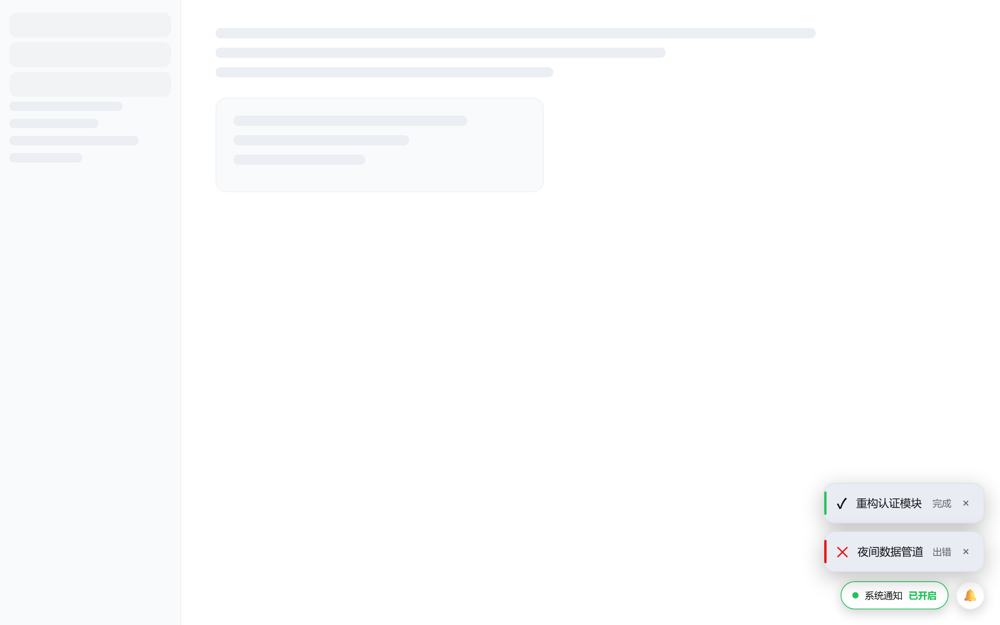

# dsh-live-notify

> [English](./README.md)

一个 [DeepSeek Harness](https://github.com/deepseek-ai/deepseek-harness) 动态 Cordis 插件:会话回合完成或出错时,在页面右下角弹出 toast;当你离开页面(切走标签页 / 最小化 / 窗口失焦)时,补发浏览器**系统通知**。

界面文案跟随 harness 语言设置(English / 中文),配色全部使用 harness 主题 token,明暗主题自适应。

## 功能

- **页面内**:其他会话的回合完成/出错 → 主题化 toast(完成 8 秒 / 出错 15 秒);点击跳转会话、悬停暂停、× 关闭、同屏最多 3 条
- **离开页面**:任何会话(含当前会话)完成 → 系统通知,点击通知聚焦窗口并跳转到对应会话
- **回到页面**:离开期间的事件以 toast 补弹;未授权系统通知时,标签页标题以「●」闪烁代替
- **控件**:状态胶囊(绿=开启 / 红=关闭 / 黄=点击授权 / 红点=被阻止)+ 静音铃铛
- **i18n**:全部插件文案跟随 harness 语言(`zh` / `en`),`locale/change` 时实时切换

## 仓库结构

| 文件 | 内容 |
|---|---|
| `src/host.js` | Host 半代码(`cordis_define` 的 `code.host`) |
| `src/client.js` | Client 半代码(`cordis_define` 的 `code.client`) |
| `plugin.json` | 插件元数据(id 前缀、名称、用途、版本) |
| `assets/` | 截图(浅色主题) |

## 安装

这是一个**动态 Cordis 插件**:通过 DSH 会话里的 `cordis_define` / `cordis_run` 工具定义并运行。它只存活于 DSH 进程内——DSH 重启后重新安装即可(约半分钟)。

### 方式一:让 agent 从本仓库安装(推荐)

在任意带 cordis 能力的 DSH 会话中发送:

> 安装 live-notify 插件:读取 `https://raw.githubusercontent.com/<你的用户名>/dsh-live-notify/main/src/host.js` 和 `https://raw.githubusercontent.com/<你的用户名>/dsh-live-notify/main/src/client.js`,用这两个文件的内容作为 code.host / code.client 执行 cordis_define,然后 cordis_run。

- 页面会生成运行请求:点击**允许**(勾选双勾可授权该插件后续版本)。
- 激活成功后,右下角出现状态胶囊与静音铃铛。

### 方式二:本地文件安装

把 `src/host.js` 与 `src/client.js` 的内容粘贴给会话中的 agent,让它执行 `cordis_define` + `cordis_run`。

## 使用

- **状态胶囊**:显示系统通知状态,点击切换/请求授权
  - 未授权 → 点击弹出浏览器权限请求,允许后自动开启
  - 已开启(绿)→ 点击关闭(变红)
- **🔔 铃铛**:临时静音全部通知(页面内 toast 与系统通知),再点恢复
- **toast**:点击跳转对应会话;悬停暂停倒计时;× 手动关闭;同屏最多 3 条

## 系统通知排障

系统通知始终不弹时,按顺序检查:

1. **浏览器权限**:胶囊显示「点击授权」→ 点击并允许
2. **Windows 通知设置**:设置 → 系统 → 通知 → 确保你的浏览器(如 Google Chrome)允许通知
3. **专注助手**:点任务栏时钟打开通知中心,确认专注助手处于关闭状态
4. **出现位置**:Windows 通知在屏幕右下角弹出数秒,随后收入通知中心

## 已知边界(浏览器硬限制,非 bug)

- **后台定时器节流**:标签页切到后台约 5 分钟后,浏览器把定时器压到约 1 次/分钟,系统通知最长可能延迟约 1 分钟
- **浏览器完全关闭 = 无通知**:真正的后台推送需要 Service Worker + Web Push(产品级改造)
- **进程内临时**:动态插件不落盘,DSH 重启后按上面步骤重装

## 设计要点

- **事件源**:Host 半监听 `agent/status`(回合完成)与 `agent/error`(回合出错)
- **未读队列**:当前会话的完成事件先留存,用户离开页面时统一结算成系统通知——避免"事件在用户切走前就被消费过滤"的时序缺陷
- **过滤规则**:页面内只通知非当前会话(不打扰);离开时包含当前会话
- **积压策略**:每会话仅保留最新事件,错过即丢弃;超过 10 分钟的事件过期
- **主题**:全部使用 harness `--dsw-alias-*` 主题 token

## 许可

MIT,见 [LICENSE](./LICENSE)。
